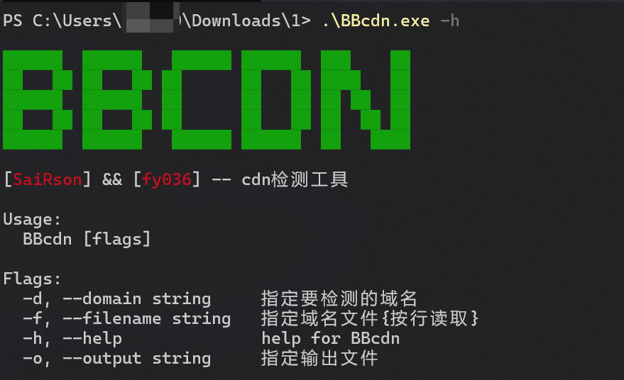
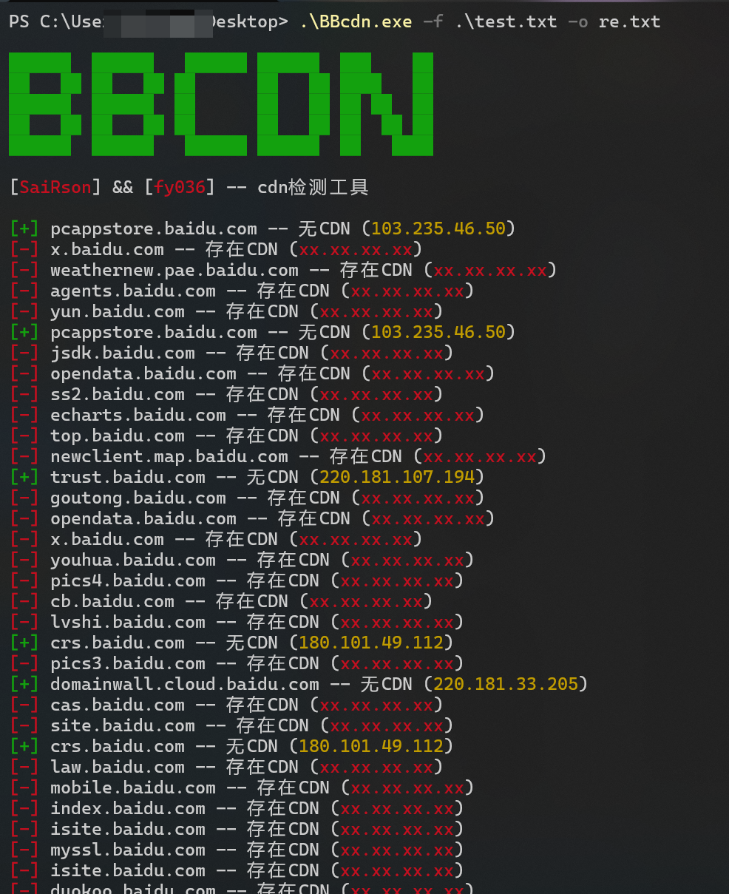

# BBcdn

BBcdn(baybay,cdn)使用全球各地的dns服务器来解析域名,判断是否存在cdn,工具简单美观.

## 界面



## 使用

### 编译

```bash
go mod tidy
go build -ldflags "-s -w" .
```

### 运行

```bash
.\BBcdn.exe -f ..\..\Desktop\test.txt -o 2.txt
```



## 其他

觉得好用,请给个星吧✨
